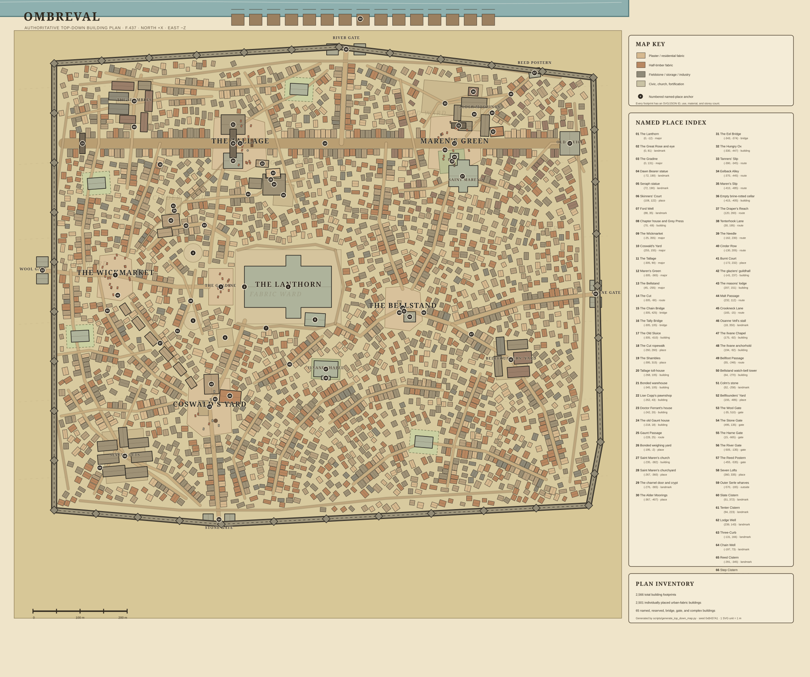

# The Cathedral-City of Impossible Light

A first-person walking simulation set in **Ombreval**, a fortified medieval
city-state built entirely in Rust with Bevy. You explore it on foot — no quests,
no HUD to speak of, just a living city to wander through and the people in it to
talk to.

The city takes its silhouette from the monumental engraving below: a colossus of
domes, spires, colonnades, staircases, and bridges crowded down to the waterline
with people going about their day. The scene is assembled procedurally from
original generated material artwork — cathedral limestone, weathered city
plaster, half-timber infill, dark fieldstone, terracotta and slate roofs, and
the great rose window.

The cathedral, **the Lanthorn**, opens into a roughly 840 × 700 m walled city.
Most streets pinch and change width between independently offset façades; each
block hides a 4.6 m route that doglegs twice, lateral alleys, projecting upper
floors, covered passages, small courts, and frequent overhead bridges between
lofts. Those dense quarters open selectively into five town squares, markets,
the dry channel of a diverted river, secondary churches and towers, and the
cathedral's ceremonial forecourt. For developer playtesting, gravity-free flight
makes the full skyline explorable.

Two things make Ombreval more than scenery:

- **The impossible light.** Through the cathedral's Great Rose — and nowhere else
  in the world — a cold green-white second sun hangs in the sky. It casts a faint
  second shadow but no heat, heals nothing, and has never been explained. The
  Church calls it *the Emblem*; the street calls it *the Green Sun*.
- **Smart actors.** The city's inhabitants are LLM-driven characters who work,
  remember, gossip, form opinions of you, and can be spoken to out loud with your
  own microphone. They live real daily routines — homes, workplaces, market days,
  a curfew bell.

## The world

> The full canon lives in [`lore/`](lore/) — history, families, occupations, the
> rose-window iconography, folk custom, and a rumor pool NPCs can draw on. What
> follows is only the shape of it. Note that most of the lore is *not* directly
> represented in the game.

**Ombreval** is a free walled city-state on the river **Serle**, roughly 840 m
west-to-east and 700 m north-to-south. Its oldest ground was a ford-market;
the Lanthorn — properly the Great Church of Saint Ambrelle, and the city's
cathedral, civic clock, largest employer, and perpetual building project — rose
a little west of the centre, its west front and Great Rose facing the stepped
forecourt called **the Gradine**.

**A city in the shell of a larger one.** Ombreval was built for about **15,000
people**; only about **5,000** remain. Three disasters explain the difference:
the *Great Rains* of F.362, which flooded the lower city and broke its river
channel; the *Hammering* of F.415, a freak hailstorm that killed thousands in a
quarter of an hour; and the *Long Departure* that followed. The city still works
— streets cluster with life around work, worship, water, and markets — but lively
ground floors now sit beneath empty upper rooms, and flood-lines and patched
rooflines are everywhere. It is a functioning city living inside its more
populous past, not a ruin.

**The five squares** organize the wards:

1. **The Wickmarket** — western chandlers' square: wax, tallow, wicks, and lamps.
2. **Coswald's Yard** — northern builders' square: stone, timber, lime, and the masons' lodge.
3. **The Tallage** — customs square on the dry river channel: tolls, weights, and pawnshops.
4. **Maren's Green** — south-eastern fish and boatmen's square, with Saint Maren's church.
5. **The Bellstand** — eastern proclamation square beneath the secular watch-bell.

Between them run named places with their own reputations — Cinder Row (the
glaziers' street), the Needle (the narrowest lane; "past the Needle" means beyond
saving), the Draper's Reach, Gaunt Passage, the Eel Bridge, the Hungry Ox tavern.
From F.83 the Serle ran straight *through* the city in a channel called **the
Cut**; after the Great Rains it was closed and turned into its present bed outside
the south wall, so the filled Cut survives as an unusually straight trade street
whose bridges and moorings keep working river-names in dry ground.

**The river and the world beyond.** The Serle keeps one name from source to sea —
*nobody renames water*. It rises in **the Combs**, passes the wool town of
**Brede**, and runs down past Ombreval to the lord's toll-town of **Harne** ("to
buy peace of Harne" means paying an unavoidable price), the salt-pans of
**Salorge** at the river mouth, with the distant primatial city of **Ostrelle**
six weeks off up the Lantern Road. These lie beyond the walls and outside the
playable game, but the city knows them at second hand, and news travels only at
the speed of feet, boats, and carried paper.

**Time, money, and faith.** Years are counted in the **Fabric era** — F.1 is the
laying of the Lanthorn's first stone, and the default present year is **F.437**.
The seven-day week opens on Bellday; bells divide the day from the Watch and
Kindling through to the Snuffing curfew. Coins are the copper **spark** (penny),
the silver **bell** (twelve sparks), and the gold **lantern** (sixty bells). The
dominant church is the **Candor**, the Church of the Sole Light, which teaches
*one light, undivided* and shapes oaths, burial, the calendar, and public
language — but trade, guilds, family, ward loyalty, crime, and civic politics all
have lives of their own.

## Maps

Ombreval is part of a wider world. The river Serle from its source in the Combs,
past Brede and Ombreval, down to Harne and the salt-pans of Salorge at the sea,
with Ostrelle far off up the Lantern Road. Everything on it is drawn from lore
and from what the city could know at second hand:


The authoritative top-down cadastral plan of Ombreval itself, including the wall circuit
with its square gates and mural towers, the five squares, wards, routes, the
Serle and outer wharves, and every building footprint
(see [`lore/places/`](lore/places/README.md)):




## Smart actors

NPCs are LLM-driven "smart actors" run by an in-process simulation
([`crates/cathedral-sim`](crates/cathedral-sim), a pure IO-free Rust crate that
owns the world state, prompt format, action parser, and turn scheduler). Three
capabilities are probed at startup and degrade independently: **cognition** (an
LLM provider drives NPC decisions and speech), **transcription** (your microphone,
via cloud OpenAI or a local Canary-Qwen model), and **NPC voices** (streaming
local Pocket TTS, streaming cloud OpenAI, or off). A missing API key never takes
the others down. To spend LLM turns economically, idle NPC "thinking" can be gated
to the player's neighborhood while speech and world sounds still reach anyone,
anywhere.

The whole cast also plays out **headlessly**, which is the fastest way to iterate
on the prompt, the scheduler, or an action verb:

```sh
cargo run -p cathedral-backends --bin cathedral-headless -- --fake -t 6    # offline, instant
cargo run -p cathedral-backends --bin cathedral-headless -- -t 10 -v       # live provider, full prompts
```

See [`AGENTS.md`](AGENTS.md) and
[`crates/cathedral-sim/AGENTS.md`](crates/cathedral-sim/AGENTS.md) for the full
architecture, the action verbs, and the "unknown people" rule.

## Tech

Core game: Rust + Bevy 0.19

## Run

```sh
cargo run --release
```

The first build is large because Bevy and its renderer compile from source.

## Configuration

The app starts in borderless fullscreen by default. Edit [config.ron](config.ron)
to change the window or smart-actor settings. The actor engine runs in-process;
each of its three capabilities - NPC cognition, microphone transcription, NPC
voices - degrades to an offline HUD state on its own when a provider key, a
microphone or a local speech worker is unavailable, and the cathedral remains
playable. Set `smart_actors.enabled` to `false` to disable smart actors
entirely. If the file cannot be read or parsed, the app safely uses the same
defaults.

Set `smart_actors.fake_backend` to `true` for the deterministic offline cast:
it uses no provider credentials or network calls while exercising the same
engine, world rules, HUD, and interaction paths.

## Controls

- `W A S D` - walk (8 m/s)
- Hold `Shift` - run (12 m/s)
- Mouse - look
- `Space` - jump
- `B` - Debug menu
- `F` - fart (a real sound percept: everyone within 20 m hears it, and anyone
  whose view cone contains you knows it was you - see `features/sounds.md`)
- `'` - toggle gravity-free flight (physical key position; `ä` on sv-SE)
- `Space` / `Ctrl` - rise / descend while flying
- `Esc` - release the mouse
- Left click - recapture the mouse
- `F5` / `´` - save a PNG to
  `logs/latest_session/screenshots/cathedral_screenshot_<timestamp>__<nn>.png`
  (`nn` counts up when several captures land in the same second)
- `V` - toggle the microphone on/off (on by default); speech is heard openly
  by every actor within 20 m. Recognized speech appears in tiny text near the
  bottom with a nearby-recipient count
- `Z` - toggle player transcription between the configured cloud model and
  local `nvidia/canary-qwen-2.5b` in FP16. The first local utterance installs
  the isolated NeMo environment and downloads about 5 GB of model weights;
  later utterances reuse the GPU-resident model. The bottom-left voice panel
  shows microphone, download/load, transcription, failure, and ready states
- `X` - cycle NPC voice audio through available OpenAI cloud, local Pocket TTS,
  and off modes
- Mouse wheel / `1`–`9` - select an inventory item
- Right click - offer the selected item to the focused actor
- `Y` / `N` - accept or decline the active incoming offer
- `R` - retract the selected item's pending offer

Each game start increments `session` in `cathedral_meta.json` once, creates
`logs/session_<n>_<start time>/`, and repoints the `logs/latest_session`
symlink at it. The session directory collects that run's `screenshots/`, a
structured `logs.jsonl` (game, actor engine, speech workers, and drive-script
lines as JSON lines), and `prompts/` - every LLM prompt/answer exchange as a
readable `.md` plus a machine-readable `.json`.

Walking uses acceleration, friction, air control, gravity, collision, coyote
time, and buffered jumping. Flying disables gravity but deliberately keeps
collision enabled so the architecture still has physical presence.

## Tests

All smart-actor tests are offline; the fake backends never contact a provider:

```sh
cargo fmt --check
cargo clippy --workspace --all-targets --offline -- -D warnings
cargo test --workspace --offline
```
