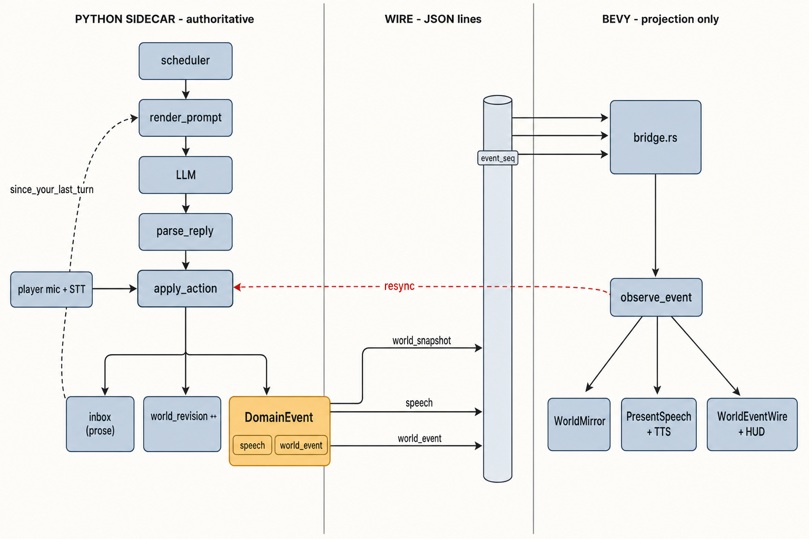

# The event flow: DomainEvent, the wire, and WorldEventWire

How an action becomes an event, crosses the bridge, and lands in Bevy — and,
at the end, where the Second Sun lore's `heard` / `witnessed` / `received` /
`remembers` predicates actually fit against this machinery.



## "Event" means three different things in this codebase

Before reading the flow, disambiguate the word. It is overloaded three ways,
and only the first is the domain concept:

| Name | Where | What it is |
|---|---|---|
| `DomainEvent` | `prompt_playgound/sim.py:121` | A thing that happened in the world. The subject of this document. |
| `BridgeEvent` | `src/smart_actors/bridge.rs:372` | Transport lifecycle only — process started, disconnected, TTS audio arrived. Nothing to do with the world. |
| `#[derive(Message)]` | `src/smart_actors/speech.rs`, `mod.rs:307` | Bevy's own buffered-event system. Bevy 0.19 renamed `Event` → `Message`, so the ECS layer does not use the word "event" at all. |

## 1. The authoritative path (Python owns the cause)

Every event originates inside `sim.apply_action`. There are two ways in, and
they converge on the same function — which is why player speech and NPC speech
are indistinguishable downstream:

- **NPC turn:** `scheduler` picks an actor → `prompt.render_prompt` builds the
  character sheet and *drains that actor's inbox* into `since_your_last_turn` →
  `llm_client.complete` → `prompt.parse_reply` splits the reply into
  `VERB {json}` lines → `sim.apply_action` applies each one.
- **Player speech:** microphone → `player_audio_chunk` / `player_recording` →
  STT → `server.py:1592` calls the same `apply_action` with `verb="say"`.
  (`debug_player_say`, `server.py:961`, is the text-only shortcut.)

`apply_action` then does up to three separate things, and keeping them apart is
the whole point of the diagram:

**a. It emits a `DomainEvent`** via `world.emit()` (`sim.py:195`), which appends
to `world._events` and assigns a monotonic `sequence`. The dataclass:

```python
@dataclass(frozen=True, slots=True)
class DomainEvent:                                  # sim.py:121
    sequence: int
    event_type: Literal["speech", "world_event"]
    kind: str
    actor_id: CharIdStr
    target_id: CharIdStr | None = None
    item_id: ItemIdStr | None = None
    text: str | None = None
    position_m: Vec3 | None = None
    recipient_ids: tuple[CharIdStr, ...] = ()
```

Note the split in `event_type`. **Speech is an event, but it is not a
`world_event`** — they are siblings, and they leave as two different wire
message types. The complete set of what exists today:

| `event_type` | `kind` | Emitted at | Recipients |
|---|---|---|---|
| `speech` | `say` | `sim.py:544` | everyone within **20 m** |
| `world_event` | `offer_item` | `sim.py:627` | within **4 m** |
| `world_event` | `accept_offered_item` | `sim.py:692` | within 4 m |
| `world_event` | `decline_offer` | `sim.py:744` | within 4 m |
| `world_event` | `retract_offer` | `sim.py:594`, `785` | within 4 m |
| `world_event` | `eat` | `sim.py:822` | within 4 m |

That is the entire event vocabulary of the shipped game: **one speech kind and
five item-economy kinds.** Recipients come from `World.characters_within`
(`sim.py:166`) — full 3D distance, inclusive bounds, stable ordering.

**b. It appends prose to recipient inboxes** via `_notify` (`sim.py:455`) —
`"Conny said: …"`, `"Sven ate a fish"`. This is **not** an event and **never
crosses the wire**. It is a plain string queued on the `Character`, consumed by
that actor's *next* `render_prompt` as `since_your_last_turn` (the dashed loop
in the diagram). Only `control == "llm"` actors get one; the player is never
scheduled, so the player's inbox would never be read.

**c. It bumps `world_revision`** via `touch_public_state` (`sim.py:162`),
which is what later triggers a snapshot.

**Events are for Bevy. Inbox prose is for the LLM. Snapshots are the truth.**
Three audiences, three channels, one action.

## 2. The wire (version-1 JSON lines over the child's stdout)

`server._flush_domain_events` (`server.py:2000`) calls `world.drain_events()`
and fans each event out by type — `speech` events additionally queue TTS and
acquire the speech floor; everything else goes out as `world_event` carrying
only `kind`, the ids, and `recipient_ids`. Separately,
`_send_snapshot_if_changed` (`server.py:2050`) emits a `world_snapshot`
whenever `world_revision` has advanced past the last one sent.

Every message is wrapped by `protocol.server_envelope` (`protocol.py:117`):

```json
{"protocol_version": 1, "session_id": "…", "message_id": "python-42",
 "type": "speech" | "world_event" | "world_snapshot" | …,
 "payload": { … }, "event_seq": 42}
```

`event_seq` is the load-bearing field: a single monotonic counter across *all*
message types. It is what makes the gap detection below possible.

## 3. The projection (Bevy owns only the playback)

The reader thread in `bridge.rs` wraps each parsed line as
`BridgeEvent::Message(ServerEnvelope)` and pushes it down a channel. In
`mod.rs`, `drain_bridge_messages` then:

1. **Checks the sequence** — `mirror.observe_event(session_id, envelope.event_seq)`
   (`mod.rs:470`). On an `EventSequenceGap` it sets `runtime.resyncing`, fires a
   `resync_request` back at the sidecar, and *drops* the message. While
   `mirror.needs_resync()`, every non-snapshot message is skipped (`mod.rs:486`)
   and player commands are blocked until the replacement snapshot lands. That is
   the red arrow in the diagram.
2. **Dispatches on `message_type`** (`process_server_message`):
   - `world_snapshot` → reconciles the `WorldMirror`. **This is the only path
     that may change state.**
   - `speech` → `SpeechWire` → a Bevy `PresentSpeech` message (`mod.rs:662`) →
     subtitles and TTS playback.
   - `world_event` → `WorldEventWire` (`mod.rs:352`) → `describe_world_event`
     (`mod.rs:1112`) → a HUD toast. The comment at the call site is explicit:
     *"This is presentation feedback only. Offers and ownership still reconcile
     exclusively from authoritative snapshots."*

So events are **notifications, not state**. If you deleted every `world_event`
the game would still be correct — just silent. That property is what makes
resync-on-gap safe.

## 4. Where `heard` / `witnessed` / `received` / `remembers` fit

`lore/second_sun/design/03_questlines.md:15` proposes four quest triggers:

```
heard(actor, pattern)     matching speech transcribed within 20 m
witnessed(actor, event)   a public act perceived — a funeral, an offer,
                          a face at a grate
received(actor, item)     an offer accepted within 4 m
remembers(actor, key)     a durable memory exists
```

**These are predicates, not events** — and the distinction is load-bearing, not
pedantic. An event is a thing that happened: emitted once, sequenced, fanned out
to recipients, then gone. A predicate is a *question asked about the accumulated
stream*: "has this actor heard this pattern yet?" Implementing `heard` as an
event kind would be a category error — you'd be emitting derived data as if it
were a fact about the world.

The useful question is therefore not "are these four events?" but **"what does
each one need from the event layer that isn't there?"** They answer very
differently:

| Predicate | Event source today | Actually missing |
|---|---|---|
| `received` | ✅ `accept_offered_item` | **Nothing.** Pure query over an existing event. |
| `remembers` | — (never an event) | **Nothing.** Query over `Character` memory state. Memory is state, not stream. |
| `heard` | ✅ `speech` event with `recipient_ids` | **A matcher, not an event.** The fan-out already exists; what's absent is pattern-matching the text per recipient against a watch list. |
| `witnessed` | ❌ **nothing** | **New events *and* a new sense.** |

`witnessed` is the only real hole, and `04_systems_integration.md:8` concedes it
in passing: *"`witnessed` has no existing event source."* Two things are missing
under it, not one:

1. **Event kinds for things that aren't item transfers.** Today's five
   `world_event` kinds are *entirely* the offer economy. Nothing in the sim emits
   "a funeral happened", "a face appeared at the grate", "a lamp was lit",
   "a meeting sat". There is nothing to witness.
2. **A seeing radius.** Every recipient list in the sim is computed by
   `characters_within` at 20 m (speech) or 4 m (offers) — i.e. *hearing*. There is
   no visibility calculation at all. `witnessed` needs one, and 4 m is plainly
   wrong for a funeral.

Read that way, the codebase has exactly **one perception channel** — hearing, at
one fixed radius — and the lore wants three: heard (speech *and* sound, variable
radius), seen (witnessed, needs a visibility model), and remembered (state, no
event at all).

Which is also why `06_the_sound_of_the_city.md:74` proposes the corpus's **one
genuinely new event type**, `{type: "sound", …, audible_m, percept}`: it is
`heard` generalised past 20 m. And its "heard-event" — despite the name — is not
a wire event either. §5 gives it away: the sidecar *"injects `percept`
transiently"*, which is precisely what `_notify` already does. The mechanism the
bell design needs is the inbox, generalised from one source (speech) to N.

**The implementable shape, then, is three primitives rather than four events:**

- a **percept fan-out** — `_notify` generalised, so any cause (speech, bell,
  funeral, sighting) can put a sentence in an actor's inbox with its own radius;
- **new `world_event` kinds** for the non-item things that happen in the city,
  plus the visibility calculation that gives them recipients;
- a thin **predicate/matcher layer** the quest triggers read — `heard`,
  `witnessed`, `received`, `remembers` are four *query functions* over the event
  log and the memory store, and none of them belong on the wire.

Nothing above is implemented. All seven docs under `lore/second_sun/design/`
open with the same line: *"This is a proposal. Nothing below is implemented."*
