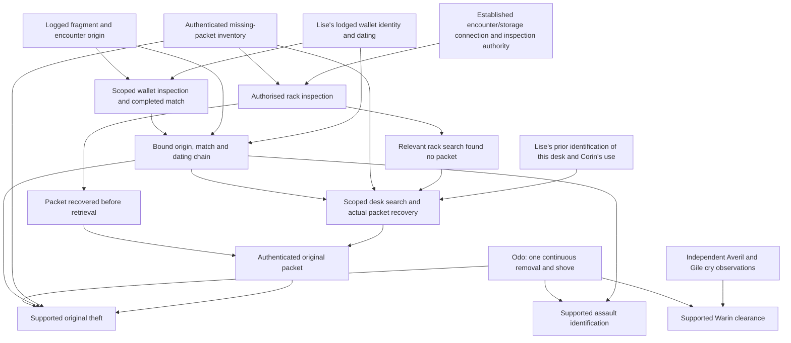

Status: Proposed content repairs and implementation contract (2026-09-05); to be validated before M15 authoring.

# The complete case the plan must deliver

The GDD supplies the quest's dramatic shape. This contract resolves defects and omissions found while planning it against the user's decisions. These are explicit proposed implementation repairs, not claims that the original manuscript or companion validator already contains them.

## Core history

One person removes the identified packet and shoves Odo during one continuous encounter. Odo survives. Warin later finds and helps him. Corin's two pawn-counter sightings are real; Lise does not continuously watch the counter between them. The upper connection changes what journey was possible, but does not by itself identify an offender.

Author E01 more precisely: Odo records, before player involvement, that the same person put the packet into the wallet he grasped, that the catch broke during that struggle, and that the shove and removal belonged to that one encounter. He cannot identify the face well enough to name Corin. This supplies the missing act-link for a complete physical-evidence route.

Keep the fixed crime before world opening. Do not spawn it when the player accepts a quest, and do not reset witnesses or the packet on reopening an inquiry.

## Cast

| Role | Stable cast | Implementation treatment |
|---|---|---|
| Suspect/scrivener | Corin Copp `fc9rn` | Existing major; own acts and chosen denials are private actor knowledge |
| Pawnbroker/aunt | Lise Copp `fl5cp` | Existing major; two actual sightings, loyalty and limited observation |
| Injured notary | Odo Trask `fo6gl` | Existing minor; victim/examiner, not judge of his own assault |
| Initially accused carter | Warin Underbridge `fw7ub` | Existing minor; independent alibi, separate hold/clearance/favour records |
| Beam witness | Averil Tarn `fa8tn` | Existing minor; affection does not replace independent corroboration |
| Writer/second witness | Gile of Brede `fg4br` | Existing minor; distinct observation root and pre-existing counterfoil |
| Institutional investigator | Segwin Mott `p00a3` | Promote from ambient to major, with authored duties and relationships |

`lore/characters/AGENTS.md` prohibits individually required ambient quest references. Mott therefore needs a stable tier before content can reference him. Choosing major fits his recurring investigator role. The four current minors can remain stable supporting figures; their required actions do not depend on a major's cognition budget. Preserve Mott's actual home/district while assigning Tallage duties.

## Readable papers and the household's tools

M15 must author complete operative excerpts, not only a paragraph saying “some forged papers.” Use a coherent pledge record, purported release and pre-incident counterfoil with stable document and object IDs.

Default content to develop: a twelve-spark pledge over a marked iron plane, brace and three chisels. The genuine record permits the debtor household to redeem its tools upon payment. The purported release falsely acknowledges payment and substitutes Corin's client as authorised collector. Odo's pre-incident counterfoil identifies the packet and records the authenticity concern. His later E16 comparison establishes which record is genuine and what collection authority fails.

Fix the initial economic state: the genuine twelve-spark redemption remains **unpaid**, and the tools remain in Lise's lawful pledge custody. Invalidating the client's false collection authority protects the household's redemption right; it does not erase its debt or order free delivery. A later genuine payment, supported settlement or independently valid release can create the ordinary return instruction. Author the actual balance and receipt before promising delivery. Eight-spark restitution is a different obligation and cannot silently count as twelve sparks paid on this pledge.

Resolve the household recipient and client through existing lore where suitable, or explicitly author document-only parties under the lore rules. They are not extra mandatory conversation witnesses. Give the tools real individual/stock identities, a present holder/container, a named return recipient/destination and a deliverable ordinary return operation.

The case does not automatically solve every forgery in Corin's biography. Its finding concerns these particular documents and acts.

## Evidence corrections

The E01–E16 labels remain a reading cross-reference to the GDD. Runtime data should use stable descriptive proposition/result IDs, with separate records where one label previously concealed several facts.

| GDD entry | Required implementation meaning |
|---|---|
| E01 | Odo's pre-player account of the sole continuous shove/removal encounter, packet identity and wallet/catch interaction |
| E02 | Authenticated pre-incident packet/counterfoil inventory, with specific contents and provenance |
| E03/E04 | Actual two sightings and actual interval without counter observation; neither implies continuous presence |
| E05 | Supported conservative work interval, after complete physical timing has been re-authored/measured |
| E06/E07 | Averil's and Gile's independently rooted observations of Warin at the same relevant cry |
| E08 | Learned private connection and separately established historical access, not just today's open door |
| E09 | The actual authenticated packet and admissible knowledge of its custody |
| E10/E11/E12 | Fragment origin, physical fracture match, and intact-before/broken-after dating tied to the same specifically identified Corin wallet as separate support |
| E13 | A verified continuous object-identity observation of a particular retrieval/handling act; interruption weakens it |
| E14 | Voluntary confirmed admission of named acts, with separately verified corroboration |
| E15 | Split into the original continuous-presence assertion, an actual incompatible later account if made, and any separate denial of knowing/controlling the packet |
| E16 | Specific original/false-release examination supporting a property/collection determination and resulting instruction |

Corin simply stating his alibi does not award its contradiction. The blind interval establishes that Lise cannot corroborate continuous presence; it does not prove he left. His next-day retrieval does not contradict yesterday's two counter sightings. If he denies knowing/controlling the missing packet, a verified retrieval can contradict that denial, but later possession alone does not prove the original theft.

Every proof conjunction binds the same incident, relevant cry/interval, actor, packet and wallet. An authenticated packet from another dispute, a dating account for a similar wallet or an admission to another theft cannot fill a missing predicate in this case.

## Required finding paths

| Finding | A complete supported route | Must remain insufficient |
|---|---|---|
| Correct the claimed corroboration of a continuous alibi | Two sightings plus the independently supported unseen interval; result says continuous presence is uncorroborated, not disproved | A finding that Corin lied merely because he could have left |
| Establish opportunity | Supported interval + valid private-route result + historical access | Today's open passage alone |
| Clear Warin through witnesses | E01's relevant event + E06/E07 with independent origins and correct cry relation | Two retellings of Averil's account |
| Clear Warin through another identified assailant | E01 establishes the same sole assailant/remover; independent evidence identifies that person | Corin's later possession or theft-only support |
| Recover property | Authenticated E02/E09 and supported handling/custody | A similar bundle or an omniscient hidden-location lookup |
| Substantiate original theft physically | E01's continuous packet-removal account + authenticated E02/E09 + the verified E10–E12 origin/match/time chain | Opportunity plus packet found in shared storage |
| Substantiate assault physically | E01 plus verified E10–E12 origin/match/time | Undated matching metal or later possession |
| Substantiate admitted theft/assault | Confirmed admission of those acts plus the corresponding independent material/detail corroboration | Vague guilt, a bare confession or an act the speaker never admitted |
| Establish improper collection/release | E16's authenticated document comparison and specific false authority | Handwriting resemblance alone |

Keep knowingly concealing/handling stolen property distinct if a surveillance route supports that narrower allegation. Do not relabel it original theft merely to award the intended ending. Surveillance can lead to further examination, an admission or the full physical chain.

The following is a developer dependency view, not a prescribed player checklist. All inputs to a conjunction must refer to the same supported objects, people and incident; the arrows do not replace procedural authority, consent or actual examinations.

Opportunity is established separately by the timed route and historical access. It is useful to understanding the place and testing the claimed alibi, but never substitutes for the identity/act chain above. The admission and later-handling alternatives retain the narrower requirements in the table.

## A concrete private corroboration route

Author a short exchange immediately before the shove that only Odo and the assailant heard. One proposed exchange is Odo's quiet “Leave the pledge” and the reply “Then neither.” Fix the exact approved text during M15 writing and record it privately before the player can ask about it.

The suspect must supply and voluntarily confirm the relevant detail independently. Verification compares the sealed records and the disclosure history established to the reviewer, rather than reading a culprit flag or every private whisper in the world. A leading question or prior publication **established in the admissible record** defeats a claimed independent match. The finding states that no such disclosure is established, not that omnisciently none occurred. A secret leak may mislead the review until discovered and then justify amendment; identical submitted records cannot expose different hidden leak histories through different diagnostics. The dated physical chain remains available.

The public evidence preview can indicate that private corroboration exists without printing the concealed content to everyone. A player's knowledge of it is tracked separately from the institution's sealed record.

## Searches and the late physical route

Author separate scopes and grounds for passage inspection, rack search, wallet comparison and locked-desk search. Permission for one does not silently include the rest.

| Requested scope | Concrete available grounds before the requested search | What it does not authorise |
|---|---|---|
| Inspect the passage and encounter site | Odo's lodged account, named site and supported need to reconstruct movement; owner consent or Mott's limited inspection procedure | Opening every tenant's private container |
| Inspect the named loft rack | Authenticated counterfoil/missing-packet description and established connection between the encounter, access route and that storage; limited consent remains an alternative | Searching Corin's wallet or desk automatically |
| Inspect/compare the identified wallet | The logged encounter fragment plus Lise's prior account identifying Corin's particular wallet and its intact-before/broken-after change; the comparison result is not yet required | A general search of all his possessions |
| Extend inspection to the identified desk | Authenticated missing-packet inventory, a relevant failed rack search, the now-supported encounter/catch chain, and independent evidence of Corin's use of this desk | Treating a packet already found there as the prerequisite grounds |

M15 installs Lise's voluntary pre-player deposition alongside the original inquiry records. In defending the alibi she recorded the two sightings and the wallet she saw before/after, including a specific visible repair/mark identifying the same wallet. She also identified the particular upper-room desk Corin ordinarily uses, by stable location and visible distinguishing features. This supplies the desk-use ground before anyone searches that container. The existing counterfoil's general reference to work passing through “Corin's desk” is insufficient by itself to identify a particular locked object.

She need not have known what the broken catch meant or that a packet would later be in the desk. Author the exact distinguishing details on the physical objects and in her account. The original deposition is retrievable from the ordinary authorised docket when she is absent or later refuses to repeat it; a copy retains her single source origin. It is not a new witness, and it is not secretly granted to the player at opening.

The late route can therefore reach wallet inspection before obtaining the match, then reach a desk search without already possessing the packet. Authenticate the packet's inventory/description through the existing counterfoil. Later statements may amend or challenge Lise's deposition, preserving its original confirmation and source rather than overwriting it.

Consent and official inspection remain alternatives. Denial can create a need for grounds, travel and an authorised opener; it does not delete the physical route from the game. An unavailable Mott/keeper uses the ordinary institutional recovery policies, not a Corin-specific unlock.

## Moving packet operation

Initial state: the packet is in the loft rack H. A successful real retrieval moves H → Corin's physical custody → his actual desk. Its destination is not a teleport target.

At Lamplight, Corin attempts the authored activity if he can act and the packet remains accessible. Early recovery, another holder, detention, blocked access or an active lawful seizure is handled through current state. One delayed attempt is permitted within the same Lamplight office after an actually learned warning; author its delay policy and alternative entrance against M14 geometry. If the attempt is abandoned, the packet stays wherever the last completed physical step left it.

There is no later invisible cleanup move. Observing Corin receive a packet from the player does not prove he stole it before. Hiding evidence or planting it may deceive a casual observer; a formal inquiry can reject only defects established through admissible knowledge, not private omniscient history.

## Normal-city schedule and missed events

The GDD's day numbers are **case-relative**, not instructions to overwrite the city's civil day. Current normal configuration opens on civil day 2 at Dayspring. Resolve and persist an opening/incident calendar anchor at fresh-world creation: the crime belongs to the previous civil day's High Wick, retrieval is the first strictly future Lamplight, and review is the first High Wick strictly after that retrieval. Store the resolved absolute dates and historical event offsets; do not recompute them when the player engages, loads or uses a late developer start.

At the default Dayspring opening and unchanged hour-long day, this gives the GDD's case-day-1 Lamplight/case-day-2 High Wick windows: about 27.5 and 72.5 real minutes. A different opening office or changed clock rate changes the running opportunity, and the UI reports the actual calendar dates. It does not promise these real-minute values universally. The completed historical sequence must predate creation under its explicitly recorded historical time basis; accelerated developer clock settings must not map a victim's later arrival into the future by blindly reusing current seconds-per-day on past elapsed offsets.

Warin's original hold expiry is resolved from its historical grounds and authorised duration **independently** of those future appointments. A fresh world opening at a later office may leave less hold time, or see release before its later review. Choosing a conveniently future review cannot renew detention. A developer “late case” starts from the same saved original anchor and advances production simulation; creating a new anchor at the requested late clock would reset the case.

A player taking 75–100 minutes cannot attend the original 72.5-minute review as though it waited. They can obtain an earlier limited finding, lodge evidence for that review, arrive after it, request a later review or reopen the result.

One supported deferral moves the meeting to the next High Wick. It **does not extend Warin's original detention expiry**. Hold authority, review appointment, sponsorship and formal clearance have separate records. Averil can voluntarily sponsor provisional release under the authored procedure; sponsorship does not itself prove innocence.

Default sponsorship terms: Averil gives a reachable address and undertakes to relay an actually delivered review notice; Warin separately accepts an obligation to report at the named next High Wick window. Both accept before sponsored release is ordered. A missing acceptance leaves sponsorship pending, while the original hold still expires on its own authority. A missed report causes a recorded failed attendance, contact/rescheduling and, where supported, a fresh summons inquiry; it does not automatically renew custody. Deliberate evasion requires established grounds distinct from absence. Define the reporting window and notice lead time in M15, using the normal journey/appointment policies.

An unattended hearing considers what has actually been lodged, including valid autonomous submissions by NPCs. The result is not hardcoded to leave Warin suspected whenever the player is absent. Nor do autonomous submissions invent undisclosed player deductions.

## Rewards and lasting actions

Eight-spark restitution and a hush payment are distinct agreements with named payer/payee, purpose and fulfilment state. **Private restitution is Corin → Warin**, compensating lost work alongside a supported sealed submission to Mott; it purchases neither erasure nor immunity. **Hush money is Corin → player** for withholding named material. Reserve spendable funds when an agreement is accepted, transfer once and record insufficiency as an explicit outstanding obligation. Repeated hearings/reloads cannot pay it twice.

Default hush terms are finite and displayed before acceptance: Corin pays the player eight sparks to withhold a specifically named packet/account bundle from institutional submission or disclosure until the specified next High Wick deadline. **Sealed delivery of that bundle to Mott also breaks these terms**; it belongs to the separate legitimate private-submission route, not a loophole making hush harmless. Warin's independent cry-witness accounts can be explicitly excluded from the withheld bundle, allowing his separate clearance without substantiating the Corin case. Already lodged records cannot be recalled by this bargain.

Actual payment and the silence deadline are separate steps. The undertaking completes only at expiry if no established breach occurred. Disclosure by Odo or another independent source is not the player's breach. A proven breach permits Corin's agreed repayment demand; any institutional civil remedy must pass the ordinary procedure and may be refused where an evidence-withholding term is not enforceable. There is no instant confiscation, magical renewed hold or cancellation of evidence. Corin receives no immunity and cannot forbid another witness from speaking. M15 fixes the exact referenced records, deadline and recipient scope; M17 must show what inquiry may remain mistaken/unresolved. Do not merge discretion, restitution and concealment into one benign settlement choice.

Warin's cart-related thanks must be a concrete authorised cargo-journey favour, with eligible route, availability and redemption. His biography does not give him ownership of a cart to gift. Do not substitute an unusable dialogue promise or silently transfer somebody else's vehicle.

Tools return through an actual authorised handover/delivery **when genuine redemption or another valid release permits it**; otherwise their continued pledge custody and the protected redemption right are the truthful outcome. Orders enter ordinary enforcement. Corrections reach keepers and public records. Relationships and later dialogue respond to what each person learned, with room for loyal, embarrassed or resentful reactions rather than one universal reputation score.

Lise's later passage access is a concrete spatial consequence. Under the authored cooperation/disclosure outcome she may offer an accepted supervised/daylight grant through M6, or restrict/revoke her discretionary permission after an established breach. Apply only what she actually learned and what her property authority covers; a restriction cannot annul an independent lawful order. The player retains learned geography either way. Return visits and loads preserve the real grant, its conditions and expiry, rather than only a friendly/hostile line of dialogue.

## Required complete playthroughs

1. Early packet recovery, no confession and no surveillance: the full physical chain supports theft and assault; the appropriate Warin correction can follow.
2. Independent cry witnesses clear Warin with no Corin case. The player may stop there legitimately.
3. A voluntary private admission uses independently recorded corroboration; a contaminated detail route instead requires the physical chain.
4. A watcher obtains actual handling evidence, then substantiates the narrower or fuller allegation their remaining evidence supports.
5. A late player misses retrieval and review, obtains lawful desk access and completes the physical route without a bargain.
6. An explorer finds the passage or packet first and later learns its significance without reseeding or losing clues.
7. The player reads/types through scheduled events; the city continues, missed observations stay missed, and another complete route remains.
8. A supported order is issued while Corin is elsewhere; guards acquire it, search, reach him and act, or remain honestly blocked/wanted.
9. The player saves and reloads at each important boundary, including interrupted work, without duplicating an object, payment, hearing or arrest.

Update the GDD's model/validator and walkthrough text when these repairs are authored. Until then, the old validator demonstrates only its original illustrative recipes and cannot certify this corrected case.
